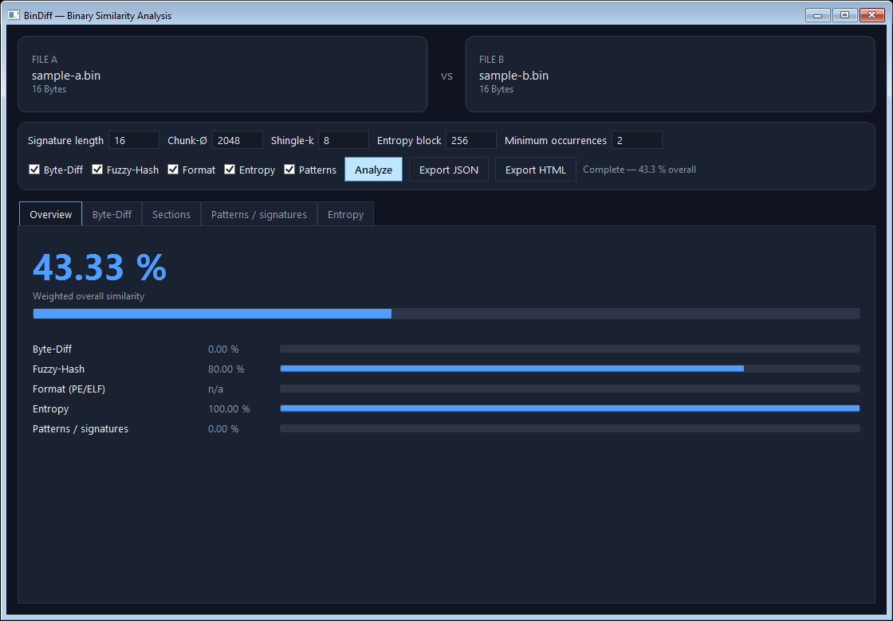
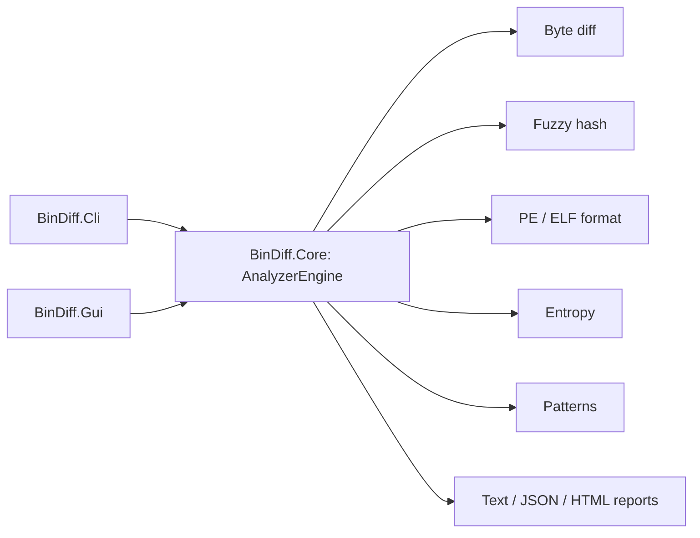

# BinDiff

BinDiff compares two authorized binary files on your machine. It brings byte
layout, fuzzy hashes, PE/ELF metadata, entropy, and repeated byte patterns into
one report so you can investigate variants, document changes, or troubleshoot
build artifacts.

It reads inputs only. BinDiff does not modify files, contact a network service,
collect telemetry, upload data, or generate binaries. Analyze only files you
are authorized to inspect.



## Modules

| Project | Purpose |
| --- | --- |
| `BinDiff.Core` | Dependency-free .NET 8 analysis engine and report writers. |
| `BinDiff.Cli` | Command-line interface with text, JSON, and self-contained HTML reports. |
| `BinDiff.Gui` | Windows WPF user interface for interactive comparisons. |
| `BinDiff.Tests` | xUnit coverage for Core behavior. |



## What it compares

- Byte diff uses content-defined chunking, set Jaccard similarity, a byte
  histogram cosine score, and a shared/unique diff map.
- Fuzzy hash uses a deterministic bottom-k MinHash sketch of byte shingles plus
  an ssdeep-style context-triggered piecewise hash (CTPH) digest.
- Format analysis recognizes PE and ELF headers and compares safe, bounds-checked
  section metadata. PE imports are compared when they can be read safely.
- Entropy analysis calculates Shannon entropy per block and compares down-sampled
  profiles.
- Pattern analysis compares fixed-length byte sequences and lists common and
  file-specific candidate static indicators.

Any binary data can be compared. Recognized PE and ELF files add metadata to
the report; other formats still receive the byte, fuzzy-hash, entropy, and
pattern analyses.

## Requirements

- .NET 8 SDK or later
- Windows with the Windows Desktop runtime for the WPF GUI

## Build and test

Run these commands from the repository root:

```powershell
dotnet build BinDiff.slnx
dotnet test BinDiff.Tests/BinDiff.Tests.csproj
dotnet format BinDiff.slnx --verify-no-changes
```

## CLI

Show the available options:

```powershell
dotnet run --project BinDiff.Cli -- --help
```

The following PowerShell example creates two disposable inputs, compares them,
and writes reports. Run it from the repository root:

```powershell
$example = Join-Path $env:TEMP "bindiff-example"
New-Item -ItemType Directory -Force $example | Out-Null
[IO.File]::WriteAllBytes((Join-Path $example "sample-a.bin"), [byte[]](0x42,0x69,0x6E,0x44,0x69,0x66,0x66,0x00,0x01,0x02,0x03,0x04,0x05,0x06,0x07,0x08))
[IO.File]::WriteAllBytes((Join-Path $example "sample-b.bin"), [byte[]](0x42,0x69,0x6E,0x44,0x69,0x66,0x66,0x00,0x01,0x02,0x03,0x04,0x05,0x06,0x07,0x09))
dotnet run --project BinDiff.Cli -- (Join-Path $example "sample-a.bin") (Join-Path $example "sample-b.bin") --pattern-len 4 --html (Join-Path $example "report.html") --json (Join-Path $example "report.json")
```

Everything it creates stays under the temporary directory. Review the reports
there, then delete the directory when you are finished.

Common options:

| Option | Meaning | Default |
| --- | --- | ---: |
| `--pattern-len <n>` | Pattern length in bytes | 16 |
| `--min-occurrences <n>` | Minimum occurrences for file-specific patterns | 2 |
| `--block-size <n>` | Target content-defined chunk size | 2048 |
| `--shingle-k <n>` | Byte shingle size for MinHash | 8 |
| `--entropy-block <n>` | Entropy block size in bytes | 256 |
| `--modules <a,b,...>` | Select `bytediff,fuzzy,format,entropy,patterns` | all |
| `--json <path>` | Write a JSON report | — |
| `--html <path>` | Write a standalone HTML report | — |

Reports include input filenames, paths, sizes, SHA-256 hashes, and derived
analysis output. Treat that metadata with the same care as the files themselves.

## GUI

Launch the GUI from the repository root:

```powershell
dotnet run --project BinDiff.Gui
```

Choose or drag in two files, select the analyses and parameters, then click
**Analyze**. The screenshot uses the synthetic `sample-a.bin` and
`sample-b.bin` files; it contains no private path or real input.

## Limitations

- Similarity is evidence to investigate, not proof of common origin or intent.
- MinHash and 64-bit pattern hashes trade a very small collision risk for bounded
  memory and practical performance.
- The analyzer loads complete inputs into memory; very large files can require
  substantial memory and time.
- PE and ELF parsing is deliberately defensive and best-effort, not a full
  disassembler or executable validator.
- BinDiff compares exactly two local files per run and does not perform semantic
  code analysis, unpacking, modification, or network retrieval.

## Security and contributing

Read [SECURITY.md](SECURITY.md) to report vulnerabilities and
[CONTRIBUTING.md](CONTRIBUTING.md) before contributing.

## License

BinDiff is available under the [MIT License](LICENSE). It covers the original
source and documentation in this repository, not third-party binaries or files
you analyze with BinDiff.

Before publishing the repository, the owner must complete the provenance check
in [release readiness](docs/release-readiness.md) and enable GitHub private
vulnerability reporting.
